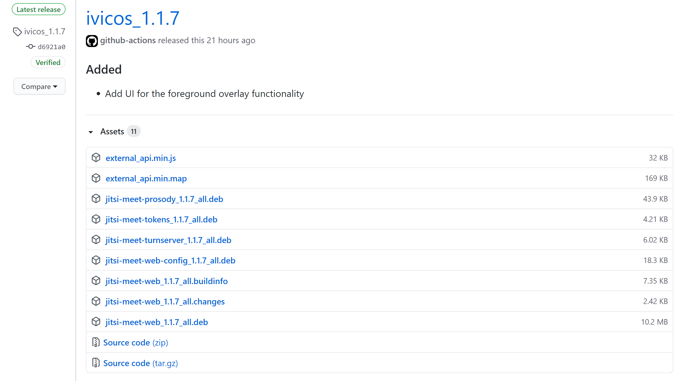

# Usage

The documentation regarding first repository setup and deployment/release procedure can be found here.

## Repository setup phase

### Installing and building

The repository can be directly build and used by running consecutively 3 commands :

```
npm install
make
make dev
```

The last command runs locally an instance of Jitsi that can be accessed via https://localhost:8080/.
Some certificate warnings are sometimes mentioned when trying to access the page on the browser and you may need to go in the advanced options to be able to access the page.

### Testing the API functionalities

In order to test some API commands :
1. run `make compile`
2. move the generated `build/external_api.min` and `build/external_api.min.map` to a temporary folder
3. Create a html file in the same folder with the following content
```
<html>
    <head>
        <script src='./external_api.min.js'></script>
    </head>
    <body>
        <div id="jitsi-container"></div>

        <script>
            var container = document.querySelector(`#jitsi-container`);
            var domain = "localhost:8080";
            var options = {
                "roomName": "TestRoom",
                "parentNode": container,
                "width": 900,
                "height": 600,
            };
            var api = new JitsiMeetExternalAPI(domain, options);
        </script>
    </body>
</html>
```
4. After starting the server with `make dev`, open the html file in a browser and target the api via the console :
ex. ` api. executeCommand('toggleVideo', false) `.

## Contributing

### Committing changes

When opening a PR and pushing some new changes, a CI pipeline is automatically triggered, checking for the compliance to linting rules, installation and building steps. The changelog is also checked : The last version needs to be bumped on each PR in order to pass the checks. The pipeline is required to succeed before merging to master.

### Merging to master

Once merged to master, a new pipeline is triggered, responsible to perform some last checks (changelog) and to create a new release (tagged as the last version of the changelog). Release artifacts are also created enabling to use the library externally, especially the expected debian packages in the Ansible configuration (jitsi-meet-web, jitsi-meet-prosody, jitsi-meet-web-config).

